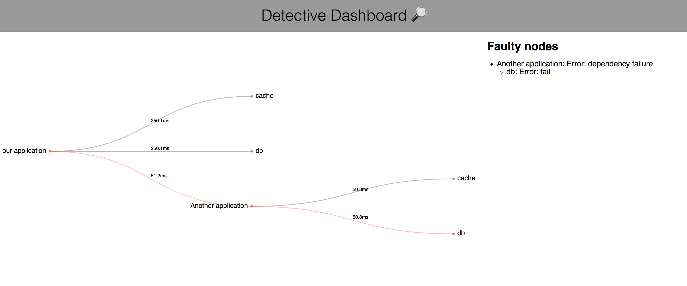

# Detective 🔎

[](https://travis-ci.org/sohamkamani/detective-node) [](https://coveralls.io/github/sohamkamani/detective-node?branch=master)

Detective is a distributed application health monitoring library. It allows you to monitor arbitrary dependencies in your application, and compose other detective instances to create a distributed monitoring framework.

>✅ Zero npm dependencies  
>✅ Interoperable with instances using the [Go client](https://github.com/sohamkamani/detective)  
>✅ Compatible with the [standard HTTP server implementation](https://nodejs.org/api/http.html#http_http_createserver_options_requestlistener) and [express.js](https://github.com/expressjs/express)  

- [Detective 🔎](#detective-%F0%9F%94%8E)
  - [Installation](#installation)
  - [Usage](#usage)
    - [Monitoring a single application](#monitoring-a-single-application)
    - [Composing instances](#composing-instances)
    - [Circular dependencies](#circular-dependencies)
  - [Dashboard](#dashboard)
  - [Examples](#examples)

## Installation

```
npm install --save detective-node
```

or

```
yarn add detective-node
```

## Usage

>For detailed documentation, visit the [Godocs page](https://godoc.org/github.com/sohamkamani/detective) 

A typical service oriented architecture looks like this:

<p align="center"></p>

Detective allows you to enable each application to monitor its own dependencies, including dependencies with contain another detective instance. By doing so, you can monitor your infrastructure in a distributed manner, where each service _only_ monitors _it's own_ dependencies.


### Monitoring a single application

Detective exposes a straightforward API to monitor an arbitrary dependency:

```js
const Detective = require('detective-node')

// Initialize a new detective instance
const detective = new Detective('Another Application')

// Initialize an arbitrary dependency, and set its detector function
detective.dependency('db').detect((cb) => {
  // The detector function is supplied with a callback argument
  // `cb` should be called with no arguments for a successful check
  // or with a single argument (typically an `Error` type) for a failed dependency
  // Here, we use the database client of the `pg` node module to make a ping query to our database
  client.query('select now()', (err) => cb(err))
})

// The `handler` method returns an http handler that can be used with
// the standard node HTTP server
const server = http.createServer(detective.handler())

server.listen(8081)
```

[See the "basic usage" example](examples/basic-usage.js)

The HTTP endpoint can then be used to monitor the health of the application. A `GET` request to `http://localhost:8081/` will return information on the health of the overall application:

```json
{
  "name": "Another Application",
  "active": true,
  "status": "Ok",
  "latency": 0,
  "dependencies": [
    {
      "name": "db",
      "active": true,
      "status": "Ok",
      "latency": 500848512
    }
  ]
}
```

### Composing instances

The endpoint in the previous example can also be used by other detective instances. For example, an application that makes use of "Another application" can monitor it as well:

```js
const detective = new Detective('your application')

detective.dependency('cache').detect((cb) => {
  myCache.ping(err => {
    cb(err)
  })
})

detective.dependency('db').detect((cb) => {
  client.query('select now()', (err) => cb(err))
})

// Add an endpoint, which represents another detective instance ("Another application" in this case)
detective.endpoint('http://localhost:8081')

const server1 = http.createServer(detective.handler())
server1.listen(8080)
```

[See the "composing detective instances" example](sample/composing-detective-instances/main.go)

Now, when we hit `GET http://localhost:8080/`, its detective instance will monitor its own dependencies as usual, but _also_ hit the previous dependencies endpoint, and as a result monitor it's dependencies as well :

```json
{
  "name": "your application",
  "active": true,
  "status": "Ok",
  "latency": 0,
  "dependencies": [
    {
      "name": "Another application",
      "active": true,
      "status": "Ok",
      "latency": 0,
      "dependencies": [
        {
          "name": "db",
          "active": true,
          "status": "Ok",
          "latency": 502210954
        }
      ]
    },
    {
      "name": "db",
      "active": true,
      "status": "Ok",
      "latency": 2500328773
    },
    {
      "name": "db",
      "active": true,
      "status": "Ok",
      "latency": 2500248450
    }
  ]
}
```

### Circular dependencies

It's possible for two applications to depend on each other, either directly, or indirectly. Normally, if you registered two detective instances as dependents of each other, it would result in an infinite loop of HTTP calls to each others ping handler. Detective protects against this situation by adding information about a calling instance to the HTTP header of its request. The callee then inspects this header to find out if it was already part of the calling chain, in which case it ceases to send endpoint HTTP requests, and breaks the circular dependency chain.

## Dashboard

The dashboard helps visualize your dependency tree and detect any faulty dependencies, along with their latency:



To run the dashboard, download the binary from the [releases](https://github.com/sohamkamani/detective/releases)

Or, if you have Go installed, install the binary with:

```
go get github.com/sohamkamani/detective/detective-dashboard
go install github.com/sohamkamani/detective/detective-dashboard
```

Then start the dashboard with:

```
detective-dashboard -p 8080
## Starts dashboard on http://localhost:8080/
```

You will then have to enter the URL of any detective endpoint to view its dashboard.

## Examples

- [Basic usage](examples/basic-usage.js)
- [Composing detective instances](examples/composing-detective-instances.js)
- [Express.js - Basic usage](examples/basic-usage-express.js)
- [Circular dependencies](examples/circular-dependencies.js)